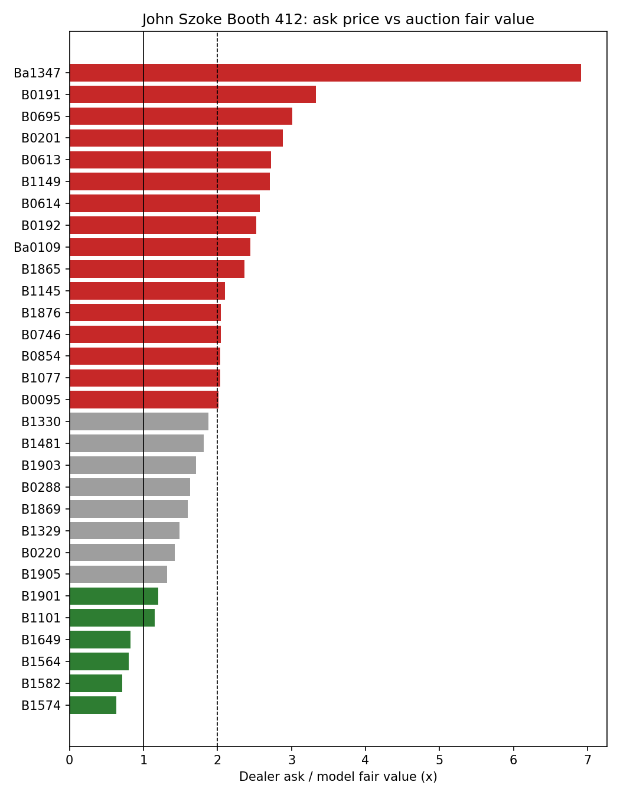

# Picasso Print Pricing: Dealer Ask vs Auction Fair Value

Are the asking prices of Picasso prints at an art fair booth in line with the auction market?

This project prices **31 Picasso prints** offered by John Szoke Gallery (Independent 20th Century, Booth 412, New York, October 2026) against **546 auction records** collected from the Artnet Price Database. A **hedonic regression** (a regression that prices an item by its characteristics) separates each print's value from *when* and *where* it was sold. That gives a time- and venue-adjusted "fair value" to compare with the dealer's ask.



## Key findings

| | |
|---|---|
| Booth total (30 prints with auction history) | ask **$6.52M** vs model fair value **$3.33M**, so **1.96x** overall |
| Range across prints | **0.6x to 6.9x**: the spread matters more than the average |
| Close to or below fair value | Suite 347 book-page etchings (0.6–0.8x), *Nature morte au verre sous la lampe* (1.15x) |
| Highest ratios | *Peintre et modèle au fauteuil* (6.9x, only 3 comparable sales), *Autoportrait Trois Formes* (3.3x, see caveats), *La Femme à la Fenêtre* (3.0x, see caveats) |
| Major-house premium | the same print sells for **~20% more** at Sotheby's / Christie's / Phillips than at specialist houses, and **~40% more** than at small houses |
| Market cycle | prices in 2005–14 were **~20% higher** than in 2023–26 (significant). 1995–99 was the trough, at about half of today's level |
| Identity premium | *La Minotauromachie* trades at **14x** what its medium, era and size alone would predict. Its price comes from the work's identity, not its characteristics |

## Method

**Data**
- `data/booth_inventory.csv`: 32 works from the booth price list (Bloch catalogue number, medium, dimensions, signature, ask price). The list was transcribed by hand from photos.
- `data/auction_comps.csv`: Artnet records matched to each work by title, year, medium and size. Ceramics, paintings, posters and different editions that share a title were removed. Two suspected bad records are flagged with `exclude = 1`.

**Sample.** 446 sold lots across 30 works. Bought-in and withdrawn lots are kept in the data, but not used to fit the models.

**Model B (main): work fixed effects**

```
ln(price) = work_i + sale_period + house_tier + special_impression + size_deviation + ε
```

The fair value is the prediction for a regular numbered impression of typical size, sold in 2023–26 at a major house. The model also reports:
- an **80% prediction interval** for a single sale;
- **P(auction ≥ ask)**: the chance that one major-house sale reaches the dealer's price.

**Model A: characteristics only**

```
ln(price) = medium + creation_era + series (Vollard / 347 / 156) + ln(area) + controls + ε
```

Model A never sees which work a lot is. It is used to value works with no sales history, and to compute the *identity premium* (Model B value ÷ Model A value).

**Estimation.** OLS with HC1 robust standard errors (standard errors that stay valid when the error variance differs across observations).

**Validation (5-fold CV, out of sample)**

| | R² | Adj. R² | Median abs. error per sale |
|---|---|---|---|
| Model B | 0.92 | 0.92 | **31%** |
| Model A | 0.66 | 0.64 | 53% |

A 31% typical error is normal for art. The same print can sell at very different prices depending on its condition, the margins and how strong the impression is, which the data does not capture. This is why the intervals matter more than the point estimates.

**Robustness checked.** Re-weighting recent sales more heavily (time-decay half-lives of 5–15 years) did *not* lower the CV error (31% → 33–34%), so the equal-weight model is kept.

## Caveats

- **Retail vs auction.** Auction prices are a secondary-market benchmark. A dealer premium is expected (curation, condition guarantees, no auction risk). The ratios are best read relative to each other.
- **Signature.** Artnet list views do not show whether a print is signed. The Suite Vollard prints at the booth (B0191, B0192, B0201) are pencil-signed, while most comparable sales are from the unsigned edition of 260. Their ratios are overstated.
- **Work-specific trends.** The time effects are shared across works. *La Femme à la Fenêtre* (B0695) has risen faster than the market: its last four sales were $110–435K, against a model fair value of $199K. Against recent sales alone, its ratio is roughly 1.4–2x.
- **Thin markets.** Ba1347 (3 sales) and Ba0109 (2 sales) have wide intervals.
- **Model A is fitted on 30 works only.** Its medium and era coefficients describe these works, not the Picasso print market as a whole.
- B0321 has no matched sales, so it has only a Model A estimate. The 1897 drawing is unique and is not modelled.

## Run it

```bash
pip install -r requirements.txt
python scripts/run_analysis.py      # writes outputs/
python -m pytest -q                 # 19 tests
```

Outputs:
- `valuation.csv`: per-work fair value, interval, ratio, P(auction ≥ ask), verdict
- `model_fit.csv`
- `shared_effects_model_B.csv`
- `characteristic_effects_model_A.csv`
- `report.xlsx`: all of the above plus the model data
- `ask_vs_fair_value.png`

## Project layout

```
src/picasso_pricing/
  features.py    # loading, cleaning, feature engineering (house tier, period, size, edition flags)
  models.py      # model formulas, OLS fit, k-fold cross-validation, effect tables
  valuation.py   # fair value, prediction intervals, ask/fair ratio, P(auction >= ask)
scripts/run_analysis.py
tests/           # unit tests for parsing and features + recovery test on synthetic data
```

## Data note

Auction records come from the Artnet Price Database, accessed through an institutional subscription. Artnet's terms restrict redistribution, so `data/auction_comps.csv` is excluded from version control (see `.gitignore`). The schema is documented in [`data/README.md`](data/README.md), so the pipeline can be rerun with your own export.
